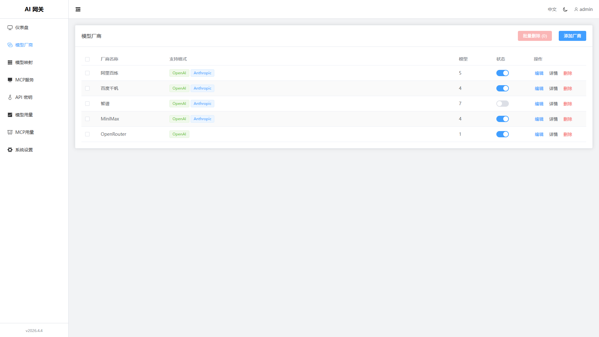
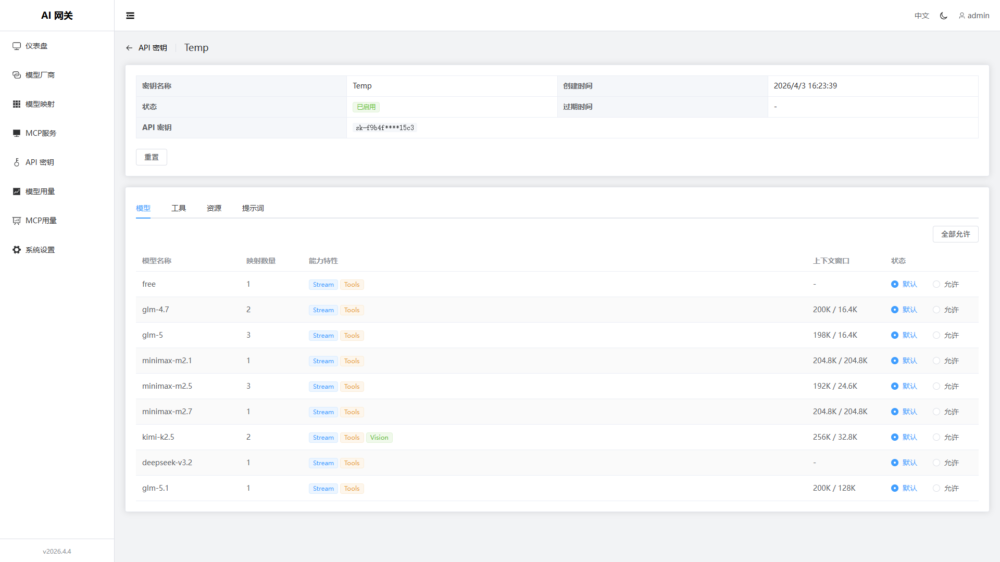
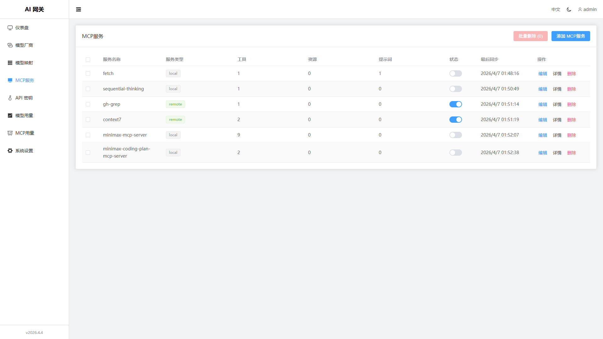
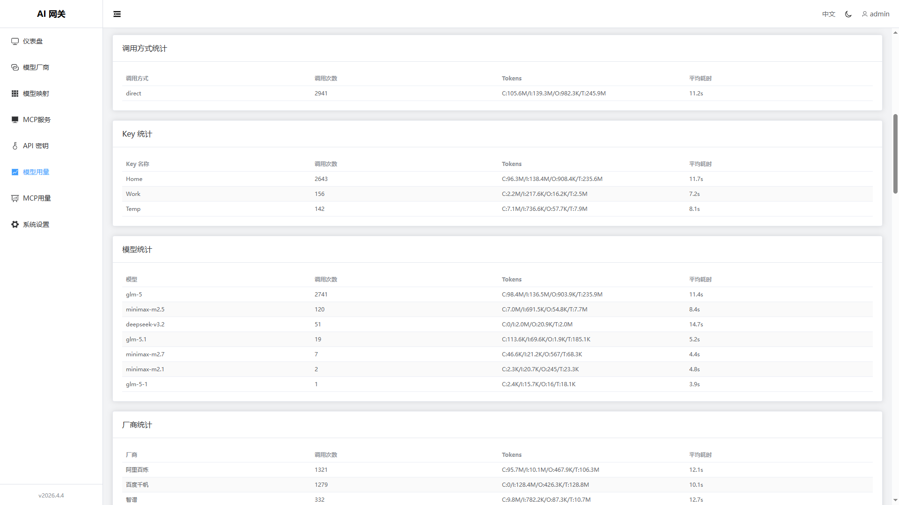
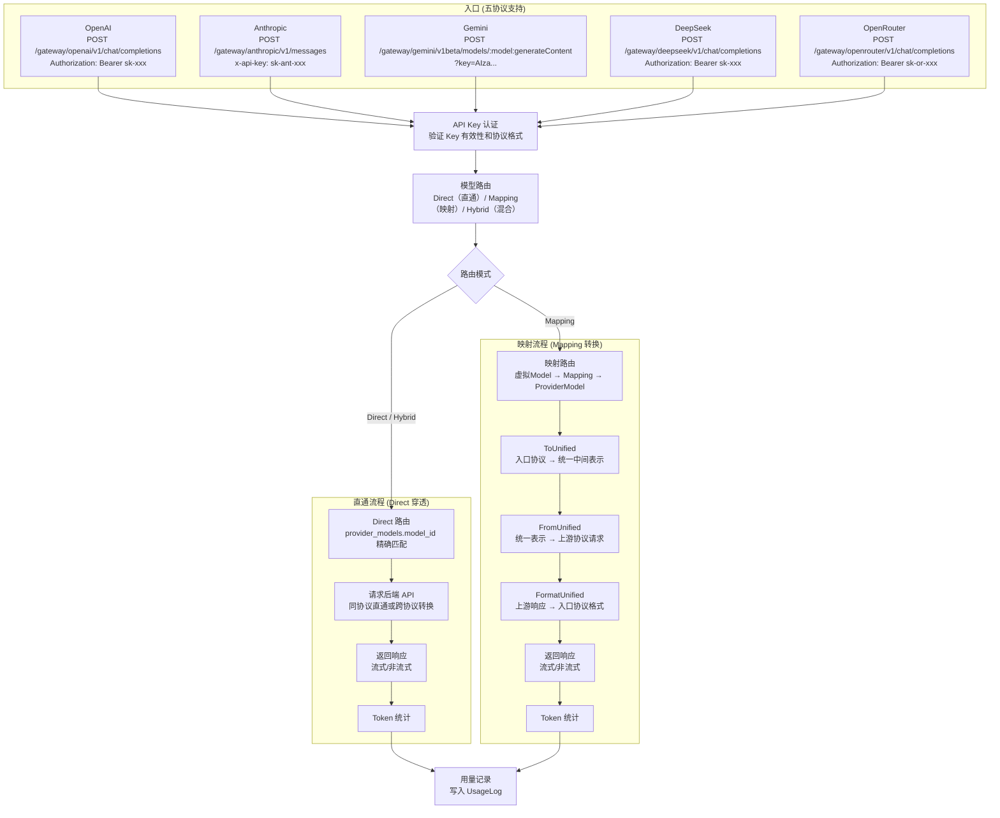
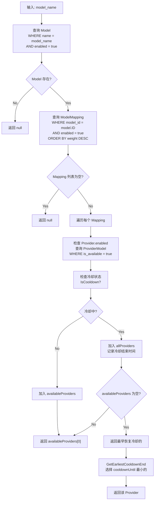
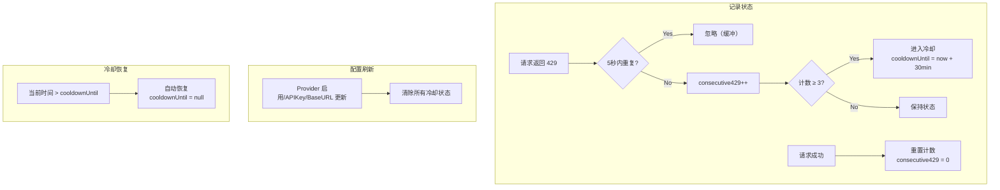

# AI Gateway
---

**此项目是作者学习大模型接口的副产物，最早的核心功能仅仅是实现 OpenAI/Anthropic API 的相互转换。**
**目前转换功能能处理文字内容（包括 “context”、“thinking”、“tools”），多模态转换从未尝试过。**
**MCP服务建议添加适合公用的远程服务，虽然能够支持 `Local` MCP，但内存需求会变大。**

统一的 AI 服务网关平台。聚合多个大模型厂商的 API，支持 MCP/ACP 协议代理，多协议 AI 服务接入中心。

## 特性

- **五协议统一网关**: 支持 OpenAI / Anthropic / Gemini / DeepSeek / OpenRouter 五种 AI API 协议代理
- **轴辐式协议转换** (Hub-and-Spoke): 以 OpenAI 格式为统一中间表示，任意协议之间自动双向转换
- **OpenAI 兼容 API**: 暴露标准的 `/gateway/openai/v1/chat/completions` 端点
- **Anthropic 兼容 API**: 暴露标准的 `/gateway/anthropic/v1/messages` 端点
- **Gemini 兼容 API**: 暴露标准的 `/gateway/gemini/v1beta/models/*` 端点
- **DeepSeek 兼容 API**: 暴露标准的 `/gateway/deepseek/v1/chat/completions` 端点
- **OpenRouter 兼容 API**: 暴露标准的 `/gateway/openrouter/v1/chat/completions` 端点
- **MCP 兼容 API**: 暴露标准的 `/mcp/v1` 接口
- **双模式路由**: Direct（直通穿透）+ Mapping（虚拟模型映射）+ Hybrid（智能混合），白名单精确到模型ID级别
- **跨厂商穿透**: 用 OpenAI Key 直通调用 DeepSeek 模型，自动协议转换
- **流式输出**: 支持 SSE（Server-Sent Events）流式响应，含 reasoning_content / tool_use 完整透传
- **故障转移**: Provider 连续返回 429 时自动冷却，配置更新时自动恢复
- **用量统计**: 请求日志和用量仪表盘，区分 call_method（direct/convert），实时监控
- **可观测性**: 支持 OpenTelemetry + Prometheus 指标导出，请求级 Trace ID
- **API Key 管理**: 生成和管理网关 API Key，支持模型/MCP访问权限控制，一键重置
- **Web 控制台**: Vue 3 管理界面，支持中英文、暗色模式、表格排序、协议对比

## 外观

| 仪表盘 | 厂商列表 | 厂商模型 | 模型映射 |
| --- | --- | --- | --- |
|  |  |  |  |
| 秘钥管理 | 秘钥详情 | MCP服务 | MCP详情 |
|  |  |  |  |
| 模型用量-1 | 模型用量-2 | 模型用量-3 | MCP用量-1 |
|  |  |  |  |

## 快速部署

Docker 镜像推送至 [GitHub Container Registry](https://github.com/aaro-n/AI-Gateway/pkgs/container/ai-gateway)。

### 拉取镜像

```bash
# 登录 GHCR（需要 GitHub Personal Access Token，read:packages 权限）
echo "YOUR_GITHUB_TOKEN" | docker login ghcr.io -u YOUR_USERNAME --password-stdin

# 拉取对应版本
docker pull ghcr.io/aaro-n/ai-gateway:test        # 测试版（每次 push，仅 amd64）
docker pull ghcr.io/aaro-n/ai-gateway:prerelease   # 预发行通用版（amd64 + arm64）
docker pull ghcr.io/aaro-n/ai-gateway:latest       # 正式发行通用版（amd64 + arm64）
docker pull ghcr.io/aaro-n/ai-gateway:v0.0.1-rc3   # 指定版本号
```

### 零配置启动（SQLite）

```bash
docker run -d -p 18080:18080 ghcr.io/aaro-n/ai-gateway:latest
```

打开 `http://localhost:18080`，默认管理员 `admin` / `admin`。

### docker-compose 部署（PostgreSQL）

```bash
cp .env.example .env && docker compose up -d
```

### 架构支持

| 镜像标签 | linux/amd64 | linux/arm64 |
|----------|:-----------:|:-----------:|
| `:test` | ✅ | ❌ |
| `:prerelease` | ✅ | ✅ |
| `:latest` | ✅ | ✅ |
| `:v*` | ✅ | ✅ |

> 完整环境变量说明见 `.env.example` 和 `web/README.md`。

## 工作原理

### 请求处理流程



### 路由决策流程



### 故障转移机制



## 快速开始

### 环境要求

- Go 1.21+
- Node.js 18+

### 安装运行

```bash
# 克隆项目
git clone https://github.com/aaro-n/AI-Gateway.git ai-gateway

# 构建
cd ai-gateway
make

# 单独构建前端
cd ai-gateway/web
make

# 单独构建后端
cd ai-gateway/server
make

# 运行
ai-gateway/server/bin/ai-gateway-server
```
> 编译产物在 `ai-gateway/server/bin/ai-gateway-server`

服务启动后访问 <http://localhost:18080>

### 默认账号

- 用户名: `admin`
- 密码: `admin`

### 配置

支持 YAML 配置文件和环境变量两种配置方式，优先级：**环境变量 > YAML 配置 > 默认值**

#### YAML 配置

在 `server/` 目录下创建 `config.yaml` 文件（参考 `config.yaml.example`）：

```yaml
debug:
  gin: false      # Gin 框架调试模式
  gorm: false     # GORM SQL 调试日志
  provider: false # Provider 调试日志
  mcp: false      # MCP 调试日志
  log_file: ""    # 日志输出文件（空 = stdout）

pprof:
  port: 6060      # 性能分析端口

server:
  port: 18080     # 服务端口
  trusted_proxies:  # 信任代理IP（逗号分隔）
    - "10.0.0.0/8"
    - "172.16.0.0/12"
    - "192.168.0.0/16"
  test_concurrency: 5  # 模型测试并发数
  session:
    secret: ""    # Session 密钥（自动生成）
    max_age: 86400  # Session 有效期

database:
  type: sqlite    # 数据库类型 (sqlite/postgres)
  path: data.db   # SQLite 数据库路径
  pool:
    max_open: 20  # 最大连接数
    max_idle: 5   # 最大空闲连接数

auth:
  default_admin:
    username: admin
    password: admin

monitor:
  prometheus:
    enabled: false       # 启用 Prometheus /metrics
    metrics_token: ""    # /metrics Bearer token
  otel:
    enabled: false       # 启用 OpenTelemetry
    endpoint: ""         # OTLP Collector 地址
    service_name: ai-gateway
```

#### 环境变量配置

所有变量以 `AG_` 为前缀：

| 变量名 | 默认值 | 说明 |
|--------|--------|------|
| `AG_DEBUG_GIN` | `false` | Gin 框架调试模式 |
| `AG_DEBUG_GORM` | `false` | GORM SQL 调试日志 |
| `AG_DEBUG_PROVIDER` | `false` | Provider 调试日志, 请求/响应记录到 `debug_provider/` 目录 |
| `AG_DEBUG_MCP` | `false` | MCP 调试日志, 请求/响应记录到 `debug_mcp/` 目录 |
| `AG_SERVER_PORT` | `18080` | 服务端口 |
| `AG_SERVER_TRUSTED_PROXIES` | `10.0.0.0/8,192.168.0.0/16,172.16.0.0/12` | 信任的代理IP CIDR范围（逗号分隔），用于获取真实客户端IP |
| `AG_PPROF_PORT` | `6060` | Pprof 性能分析端口 |
| `AG_DATABASE_TYPE` | `sqlite` | 数据库类型 (sqlite/postgres) |
| `AG_DATABASE_PATH` | `data.db` | SQLite 数据库路径 |
| `AG_DATABASE_HOST` | `localhost` | PostgreSQL 服务器地址 |
| `AG_DATABASE_PORT` | `5432` | PostgreSQL 服务器端口 |
| `AG_DATABASE_USERNAME` | `postgres` | PostgreSQL 用户名 |
| `AG_DATABASE_PASSWORD` | `""` | PostgreSQL 密码 |
| `AG_DATABASE_DBNAME` | `ai_gateway` | PostgreSQL 数据库名 |
| `AG_DATABASE_POOL_MAX_OPEN` | `20` (SQLite: `1`) | 数据库最大连接数 |
| `AG_DATABASE_POOL_MAX_IDLE` | `5` (SQLite: `1`) | 数据库最大空闲连接数 |
| `AG_DATABASE_POOL_MAX_LIFETIME` | `1h` | 连接最大生命周期 |
| `AG_DATABASE_POOL_MAX_IDLE_TIME` | `5m` | 空闲连接最大存活时间 |
| `AG_SERVER_SESSION_SECRET` | (自动生成) | Session 密钥，未设置时自动生成 |
| `AG_SERVER_SESSION_MAX_AGE` | `86400` | Session 有效期(秒) |
| `AG_SERVER_SESSION_SECURE` | `false` | Cookie Secure 标志 |
| `AG_SERVER_SESSION_HTTP_ONLY` | `true` | Cookie HttpOnly 标志 |
| `AG_SERVER_SESSION_SAME_SITE` | `lax` | Cookie SameSite 属性 |
| `AG_DEBUG_LOG_FILE` | `""` | 日志输出文件路径（留空 = 仅 stdout/stderr） |
| `AG_LOG_LEVEL` | `info` | 日志级别 (debug/info/warn/error) |
| `AG_TEST_CONCURRENCY` | `5` | 模型测试并发数 |
| `AG_ADMIN_USERNAME` | `admin` | 默认管理员用户名 |
| `AG_ADMIN_PASSWORD` | `admin` | 默认管理员密码 |
| `AG_MONITOR_PROMETHEUS_ENABLED` | `false` | 启用 Prometheus `/metrics` 端点 |
| `AG_MONITOR_PROMETHEUS_METRICS_TOKEN` | `""` | Prometheus `/metrics` Bearer token（空 = 无需认证） |
| `AG_MONITOR_OTEL_ENABLED` | `false` | 启用 OpenTelemetry（链路追踪 + 指标导出） |
| `AG_MONITOR_OTEL_ENDPOINT` | `""` | OTLP Collector 地址（如 `http://localhost:4318`） |
| `AG_MONITOR_OTEL_SERVICE_NAME` | `ai-gateway` | OTel 服务名称（在 Jaeger/Tempo 中标识） |

### 数据库配置

#### SQLite（默认）

无需额外配置，数据库文件自动创建在 `server/data.db`：

```yaml
database:
  type: sqlite
  path: data.db
```

#### PostgreSQL

1. 创建数据库：

```sql
CREATE DATABASE ai_gateway;
CREATE USER your_username WITH PASSWORD 'your_password';
GRANT ALL PRIVILEGES ON DATABASE ai_gateway TO your_username;
```

2. 配置连接：

**YAML 方式** (`config.yaml`):

```yaml
database:
  type: postgres
  host: localhost
  port: 5432
  username: your_username
  password: your_password
  dbname: ai_gateway
```

**环境变量方式**:

```bash
AG_DATABASE_TYPE=postgres \
AG_DATABASE_HOST=localhost \
AG_DATABASE_PORT=5432 \
AG_DATABASE_USERNAME=your_username \
AG_DATABASE_PASSWORD=your_password \
AG_DATABASE_DBNAME=ai_gateway \
./ai-gateway-server
```

## API 接口

### 五协议网关接口 (需要 API Key)

```
# OpenAI 协议
POST /gateway/openai/v1/chat/completions   # 聊天补全 (流式/非流式)

# Anthropic 协议
POST /gateway/anthropic/v1/messages        # Messages API (流式/非流式)

# Gemini 协议
POST /gateway/gemini/v1beta/models/:model:generateContent       # 非流式
POST /gateway/gemini/v1beta/models/:model:streamGenerateContent # 流式 SSE

# DeepSeek 协议
POST /gateway/deepseek/v1/chat/completions # 聊天补全 (含 reasoning_content)

# OpenRouter 协议
POST /gateway/openrouter/v1/chat/completions # 聊天补全
```

### MCP 协议接口 (需要 API Key)

```
POST /mcp/v1                       # MCP JSON-RPC 2.0 端点

支持的方法:
- initialize                       # 初始化，返回可用资源
- tools/list                       # 列出工具
- tools/call                       # 调用工具
- resources/list                   # 列出资源
- resources/read                   # 读取资源
- prompts/list                     # 列出提示词
- prompts/get                      # 获取提示词
- ping                             # 心跳
```

### 管理接口 (需要登录)

```
POST /api/v1/auth/login                 # 登录
POST /api/v1/auth/logout                # 登出
GET  /api/v1/auth/me                    # 当前用户
PUT  /api/v1/auth/password              # 修改密码

GET  /api/v1/providers                  # 厂商列表
POST /api/v1/providers                  # 创建厂商
PUT  /api/v1/providers/:id              # 更新厂商
DELETE /api/v1/providers/:id            # 删除厂商
POST /api/v1/providers/:id/test         # 测试连接
POST /api/v1/providers/:id/sync         # 同步模型
GET  /api/v1/providers/:id/models       # 厂商模型列表
POST /api/v1/providers/:id/models       # 添加厂商模型
PUT  /api/v1/providers/:id/models/:mid  # 更新厂商模型
DELETE /api/v1/providers/:id/models/:mid # 删除厂商模型
POST /api/v1/providers/:id/models/lookup # 查找模型
POST /api/v1/providers/:id/test-custom  # 测试自定义模型

GET  /api/v1/models                     # 虚拟模型列表
POST /api/v1/models                     # 创建虚拟模型
GET  /api/v1/models/:id                 # 模型详情
PUT  /api/v1/models/:id                 # 更新模型
DELETE /api/v1/models/:id               # 删除模型
GET  /api/v1/models/:id/mappings        # 模型映射列表
POST /api/v1/models/:id/mappings        # 添加模型映射
PUT  /api/v1/models/:id/mappings/:mid   # 更新映射
DELETE /api/v1/models/:id/mappings/:mid # 删除映射
POST /api/v1/models/:id/test            # 测试模型

GET  /api/v1/keys                       # API Key 列表
POST /api/v1/keys                       # 创建 API Key
PUT  /api/v1/keys/:id                   # 更新 API Key
DELETE /api/v1/keys/:id                 # 删除 API Key
POST /api/v1/keys/:id/reset             # 重置 API Key
GET  /api/v1/keys/:id/models            # 获取 Key 的模型权限
PUT  /api/v1/keys/:id/models            # 更新 Key 的模型权限
DELETE  /api/v1/keys/:id/models         # 清空 Key 模型映射白名单
PUT    /api/v1/keys/:id/models         # 全部允许 Key 模型映射
GET    /api/v1/keys/:id/providers       # Key 厂商白名单
POST   /api/v1/keys/:id/providers/:pid  # 添加厂商白名单
DELETE /api/v1/keys/:id/providers/:pid  # 删除厂商白名单
GET    /api/v1/keys/:id/provider-models # Key 直通模型白名单
POST   /api/v1/keys/:id/provider-models/:pmid  # 添加直通模型
DELETE /api/v1/keys/:id/provider-models/:pmid  # 删除直通模型
GET  /api/v1/keys/:id/mcp-tools         # 获取 Key 的 MCP 工具权限
PUT  /api/v1/keys/:id/mcp-tools         # 更新 Key 的 MCP 工具权限
DELETE  /api/v1/keys/:id/mcp-tools      # 全部允许 Key 的 MCP 工具权限
GET  /api/v1/keys/:id/mcp-resources     # 获取 Key 的 MCP 资源权限
PUT  /api/v1/keys/:id/mcp-resources     # 更新 Key 的 MCP 资源权限
DELETE  /api/v1/keys/:id/mcp-resources  # 全部允许 Key 的 MCP 资源权限
GET  /api/v1/keys/:id/mcp-prompts       # 获取 Key 的 MCP 提示词权限
PUT  /api/v1/keys/:id/mcp-prompts       # 更新 Key 的 MCP 提示词权限
DELETE  /api/v1/keys/:id/mcp-prompts    # 全部允许 Key 的 MCP 提示词权限

GET  /api/v1/mcps                       # MCP 服务列表
POST /api/v1/mcps                       # 创建 MCP 服务
GET  /api/v1/mcps/:id                   # 获取 MCP 服务
PUT  /api/v1/mcps/:id                   # 更新 MCP 服务
DELETE /api/v1/mcps/:id                 # 删除 MCP 服务
POST /api/v1/mcps/:id/test              # 测试 MCP 服务连接
POST /api/v1/mcps/:id/sync              # 同步 MCP 服务资源
GET  /api/v1/mcps/:id/tools             # MCP 工具列表
GET  /api/v1/mcps/:id/resources         # MCP 资源列表
GET  /api/v1/mcps/:id/prompts           # MCP 提示词列表

GET  /api/v1/usage/dashboard            # 仪表盘数据
GET  /api/v1/usage/model-logs           # 用量统计
GET  /api/v1/usage/mcp-logs             # 用量日志
```

## 使用示例

```bash
# OpenAI 协议调用 (Authorization: Bearer)
curl http://localhost:18080/gateway/openai/v1/chat/completions \
  -H "Authorization: Bearer sk-your-key" \
  -H "Content-Type: application/json" \
  -d '{
    "model": "gpt-4",
    "messages": [{"role": "user", "content": "Hello!"}],
    "stream": false
  }'

# Anthropic 协议调用 (x-api-key)
curl http://localhost:18080/gateway/anthropic/v1/messages \
  -H "x-api-key: sk-ant-your-key" \
  -H "Content-Type: application/json" \
  -d '{
    "model": "claude-sonnet-4-6",
    "max_tokens": 1024,
    "messages": [{"role": "user", "content": "Hello!"}]
  }'

# Gemini 协议调用 (Query String)
curl "http://localhost:18080/gateway/gemini/v1beta/models/gemini-2.5-pro:generateContent?key=AIzaYourKey" \
  -H "Content-Type: application/json" \
  -d '{
    "contents": [{"parts": [{"text": "Hello!"}]}],
    "generationConfig": {"maxOutputTokens": 100}
  }'

# DeepSeek 协议调用 (Authorization: Bearer)
curl http://localhost:18080/gateway/deepseek/v1/chat/completions \
  -H "Authorization: Bearer sk-your-key" \
  -H "Content-Type: application/json" \
  -d '{
    "model": "deepseek-v4-pro",
    "messages": [{"role": "user", "content": "Hello!"}]
  }'

# MCP 协议调用 - 初始化
curl http://localhost:18080/mcp/v1 \
  -H "Authorization: Bearer sk-your-key" \
  -H "Content-Type: application/json" \
  -d '{
    "jsonrpc": "2.0",
    "method": "initialize",
    "id": 1
  }'

# MCP 协议调用 - 列出工具
curl http://localhost:18080/mcp/v1 \
  -H "Authorization: Bearer sk-your-key" \
  -H "Content-Type: application/json" \
  -d '{
    "jsonrpc": "2.0",
    "method": "tools/list",
    "id": 2
  }'

# MCP 协议调用 - 调用工具 (工具名格式: symbol.tool_name)
curl http://localhost:18080/mcp/v1 \
  -H "Authorization: Bearer sk-your-key" \
  -H "Content-Type: application/json" \
  -d '{
    "jsonrpc": "2.0",
    "method": "tools/call",
    "params": {
      "name": "fs.read_file",
      "arguments": {"path": "/etc/hosts"}
    },
    "id": 3
  }'
```

## 项目结构

```
ai-gateway/
├── web/                        # Vue 3 前端
│   ├── src/
│   │   ├── views/              # 页面组件
│   │   ├── stores/             # Pinia 状态
│   │   ├── locales/            # i18n 翻译
│   │   └── api/                # API 客户端
│   └── vite.config.ts
├── server/                     # Go 后端
│   ├── cmd/server/main.go      # 入口
│   ├── internal/
│   │   ├── config/             # 配置加载
│   │   ├── handler/            # HTTP 处理器
│   │   ├── mcp/                # MCP实现
│   │   ├── middleware/         # 中间件
│   │   ├── model/              # 数据模型
│   │   ├── protocols/          # 五协议实现 (openai/anthropic/gemini/deepseek/openrouter)
│   │   ├── core/
│   │   │   ├── handler/        # 统一网关处理器
│   │   │   ├── registry/       # 协议注册表
│   │   │   ├── unified/        # 统一中间表示 (Unified Request/Response)
│   │   │   └── errors/         # 错误日志 & Trace
│   │   ├── router/             # 模型路由 (Direct/Mapping/Cooldown)
│   │   ├── monitor/            # 可观测性 (Prometheus/OpenTelemetry)
│   ├── res/                    # 静态资源
│   └── go.mod
└── openspec/                   # 设计文档
```

## 开发

1. 安装 `Go` 和 `Node.js`
1. 安装编译工具链: `sudo apt install make gcc`
1. 在 `Linux` 下交叉编译 `WIndows` 二进制文件需要安装编译工具链: `sudo apt install mingw-w64`

### 整体构建

```bash
make init     # 安装依赖
make build    # 构建
```

### 前端开发

```bash
cd web
make init     # 安装依赖
make dev      # 启动开发服务器
make build    # 构建生产版本
```

### 后端开发

```bash
cd server
make init     # 安装依赖
make dev      # 运行
make build    # 构建
```

## License

MIT