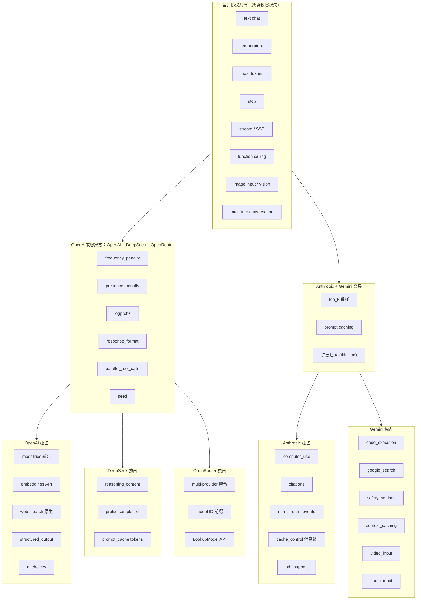

# 供应商插件化重构方案

> 目标：新增供应商只需在 `protocols/xxx/` 下加一个目录 + `main.go` 加一行 blank import，
> handler / model / router / core 全部不动。

## ⚠️ 待修复：直通模式缺少协议一致性校验

**问题**：`router.RouteDirect()` 只检查 `key_provider_models` 白名单 + `model_id` 匹配，不检查供应商的协议是否匹配 Key 的 format。

**影响**：开放了「场景 2」——用 OpenAI 格式的 Key 直连 Gemini 供应商，产生跨协议转换。这与预期行为不符（直通模式应只允许协议一致）。

**修复点**：`gateway_proxy.go` 的 `execute()` 方法中，`isDirectCall=true` 时如果 `upstreamProto != sourceProtocol` 应返回错误拒绝。

```go
// 在 execute() 中添加：
if upstreamProto == "" && isDirectCall {
    return "", fmt.Errorf("direct key does not support protocol conversion: "+
        "client=%s, provider supports %v", req.SourceProtocol, providerProtos)
}
```

## 一、核心改动

### 1. DB 层：Provider 表用 JSON 列

`model.Provider` 不再用 5 个扁平列 (`openai_base_url`, `anthropic_base_url`...)，改用单一 JSON 列：

```go
type Provider struct {
    Name      string
    APIKey    string
    Endpoints JSONMap `gorm:"type:json"` // {"openai":"https://...","gemini":"https://..."}
}
```

新增供应商只是 JSON 里多一个 key，不需要 ALTER TABLE。

性能：SQLite + 几十行数据，JSON 解析开销可忽略。查询都是 `WHERE id = ?` 先取整行再内存解析，不涉及 `json_extract` 索引问题。

### 2. Registry 接口扩展

在 `core/registry` 的 `ProtocolDescriptor` 中补齐所有差异化能力：

| 字段/方法 | 说明 |
|-----------|------|
| `Name`, `Label` | 协议标识 |
| `KeyPrefix`, `KeyLength`, `KeyEncoder` | 密钥格式 |
| `AuthExtractor` | 从请求提取认证信息 |
| `DefaultBaseURL` | 默认端点 |
| `NewProvider` | 工厂函数 |
| `TestExecutor` | 测试接口 |
| `BuildTestBody` | 构建测试请求体 |
| `ExtractContent` | 从响应提取内容 |
| `StreamURLSuffix` | 流式 URL 后缀（Gemini 特殊） |

### 3. 每个协议目录完整拆分

```
protocols/gemini/
├── descriptor.go      ← 协议元数据
├── auth.go            ← 认证方式
├── request_parse.go   ← ToUnified()：上游 JSON → UnifiedRequest
├── request_build.go   ← FromUnified()：UnifiedRequest → 上游 JSON
├── response_parse.go  ← 非流式响应解析
├── stream.go          ← SSE 流式解析
├── response_format.go ← FormatUnified()：统一格式 → 客户端输出
├── sync.go            ← SyncModels()
├── test.go            ← 连通性测试
├── capabilities.go    ← 协议能力声明
└── register.go        ← init() 自注册
```

### 4. Handler 改为通用循环

```go
func TestProvider(p *model.Provider, pm *model.ProviderModel) []Result {
    var results []Result
    for _, desc := range registry.All() {
        url := p.Endpoints[desc.Name]
        if url == "" { continue }
        results = append(results, desc.RunTest(url, p.APIKey, pm.ModelID))
    }
    return results
}
```

## 二、需要改的文件清单

### 后端（~20 个文件）

| 文件 | 改动 |
|------|------|
| `model/db.go` | Provider.Endpoints JSON 列 |
| `core/registry/registry.go` | 扩展 ProtocolDescriptor |
| `handler/model_testing.go` | 通用循环，消除 5 路 if-else |
| `handler/provider.go` | Endpoints map 替代 5 个扁平字段 |
| `handler/key.go` | fieldMap 用 registry 动态生成 |
| `core/handler/gateway_proxy.go` | getBaseURL 读 Endpoints map |
| `router/route_result.go` | SupportProtocol / GetProviderProtocols |
| `protocols/testrunner.go` | RunTest 签名改为 map，消除 switch |
| `protocols/automated.go` | 用 registry 动态遍历 |
| `protocols/openai/provider.go` | 拆为 10 个文件 |
| `protocols/anthropic/provider.go` | 拆为 10 个文件 |
| `protocols/gemini/provider.go` | 拆为 10 个文件 |
| `protocols/deepseek/provider.go` | 拆为 10 个文件 |
| `protocols/openrouter/provider.go` | 拆为 10 个文件 |
| `cmd/server/main.go` | 不变（blank import 已是正确模式） |

### 前端（~5 个文件）

| 文件 | 改动 |
|------|------|
| `views/Providers/Detail.vue` | `v-for` 遍历 endpoints |
| `views/Providers/index.vue` | 同上 |
| `views/Models/Detail.vue` | 同上 |
| `utils/protocols.ts` | 新建，集中 `getProtocolLabel()` 和 `providerLabels` |
| `views/Keys/Detail.vue` | 引用共享工具 |
| `views/Keys/index.vue` | 引用共享工具 |

## 三、实施步骤

1. **DB JSON 列**：`model/db.go` 加 `Endpoints JSONMap`，提供 `EndpointFor(name)`
2. **Registry 扩展**：补齐 `ProtocolDescriptor` 缺失字段
3. **重构 Gemini**（试点）：拆为 10 个文件，验证全流程
4. **重构其余 4 个协议**
5. **Handler 通用化**：消除所有 `if xxxBaseURL` 分支
6. **Router / Gateway 适配**：改 `getBaseURL`、`SupportProtocol`
7. **前端改版**：动态遍历 endpoints，提取共享工具

## 四、模型能力查询 API

### 设计目标

给定一个 **API Key + Model ID**，返回该请求实际路由到的上游供应商/模型**支持哪些参数、不支持哪些参数**。

这样客户端（或前端 UI）可以在调用前就知道：
- 哪些 OpenAI 参数会生效
- 哪些会因跨协议转换而丢失
- 上游供应商有什么独特能力可以开启

### API 设计

```
GET /v1/models/{model_id}/capabilities
Authorization: Bearer sk-xxxx
```

响应：

```json
{
  "requested_model": "claude-sonnet-4-20250514",
  "routed_to": {
    "provider": "anthropic",
    "provider_model": "claude-sonnet-4-20250514",
    "protocol": "anthropic"
  },
  "is_direct": true,
  "supported_params": {
    "temperature": true,
    "top_p": true,
    "top_k": true,
    "max_tokens": true,
    "stop": true,
    "stream": true,
    "tools": true,
    "tool_choice": true,
    "system": true,
    "frequency_penalty": false,
    "presence_penalty": false,
    "seed": false,
    "reasoning_effort": false,
    "modalities": false,
    "response_format": true
  },
  "provider_capabilities": {
    "supports_vision": true,
    "supports_streaming": true,
    "supports_function_calling": true,
    "supports_prompt_caching": true,
    "supports_thinking": true,
    "supports_computer_use": true,
    "max_context_tokens": 200000,
    "max_output_tokens": 64000
  },
  "warnings": []
}
```

当 `is_direct: false`（跨协议转换）时，额外返回丢失列表：

```json
{
  "is_direct": false,
  "conversion_loss": {
    "from": "openai",
    "to": "gemini",
    "lost_params": ["frequency_penalty", "presence_penalty", "seed", "modalities"],
    "degraded_params": {
      "system": "merged into single systemInstruction"
    },
    "unavailable_capabilities": ["code_execution", "google_search", "computer_use"]
  }
}
```

### 对客户端的要求：零

客户端**不需要改任何代码**。这个 API 是纯查询接口：

- **前端 UI**：可以在 Provider/Model 表单旁展示能力标签，禁用不支持的参数滑块
- **SDK**：可选用，调用前预检
- **不做任何事**：也能正常工作，只是不知道哪些参数被丢弃了

### 后端实现

在 `core/handler/gateway_proxy.go` 中，路由逻辑已有（`h.route(apiKey, modelName)` 返回 `RouteResult`）。能力查询只需复用路由结果 + `capabilities` 包：

```go
func (h *UnifiedGatewayHandler) Capabilities(c *gin.Context) {
    modelName := c.Param("model")
    apiKey := /* extract from auth */

    result, isDirect, _ := h.route(apiKey, modelName)
    if result == nil {
        c.JSON(404, gin.H{"error": "no route for this model"})
        return
    }

    // 从 registry 获取上游协议的能力矩阵
    upCaps := registry.CapabilitiesFor(result.ProviderModel.ModelID)
    entryCaps := registry.CapabilitiesFor(modelName)

    resp := buildCapabilityResponse(result, isDirect, upCaps, entryCaps)
    c.JSON(200, resp)
}
```

---

## 五、跨协议转换策略：翻译 + 透传

### 核心原则：策略 A+D（翻译 + 保留）

跨协议转换时不主动丢弃参数，而是：

1. **能翻译的翻译**：UnifiedRequest → 上游协议的请求体（如 `temperature` → `generationConfig.temperature`）
2. **不能翻译的保留**：塞入 `UnifiedRequest.TransformerMetadata`，由 `FormatUnified` 回写给客户端时还原
3. **上游不认识但无害的**：保留在请求体中（JSON 默认忽略未知字段）

### 具体行为矩阵

| 参数 | 来源协议 | 目标协议 | 处理 |
|------|---------|---------|------|
| `temperature` | OpenAI | Gemini | ✅ Mapping → `generationConfig.temperature` |
| `frequency_penalty` | OpenAI | Gemini | ⚠️ 存入 `TransformerMetadata`，响应时可能通过 warning 告知已忽略 |
| `thinking` | Anthropic | OpenAI | ⚠️ 存入 `TransformerMetadata`，响应回写时还原 |
| `safety_settings` | Gemini | OpenAI | ⚠️ 存入 `TransformerMetadata`，无法映射为 OpenAI 概念 |
| `seed` | OpenAI | Anthropic | ❌ Anthropic 会因未知字段报错 → 必须在 FromUnified 时移除 |

### 响应 Warning 头

网关在响应中注入 header：

```
X-Gateway-Warnings: frequency_penalty ignored (unsupported by upstream), seed removed
```

由 `FormatUnified` 在输出前统一处理，不侵入各协议的翻译逻辑。

---

## 六、转换状态编码 (ConversionStatusCode)

### 设计目标

每次请求的转换状态用一个 **uint64 数字** 编码，嵌入到日志字段 `conv_status` 中。通过这个数字可以在日志中快速过滤、统计跨协议转换的损失情况。

```json
// 日志示例
{
  "model": "gpt-4o",
  "conv_status": 282932408529920,
  "conv_status_hex": "0x0102000000640000",
  "call_type": "convert"
}
```

### 编码格式

```
Bit Layout (64-bit):
┌──────────┬──────────┬──────┬───────┬──────────────────────────────┐
│ 63 ... 56 │ 55 ... 48 │ 47  │ 46-32 │ 31 ... 0                      │
│ 入口协议  │ 上游协议  │ 直通 │ 保留   │ 功能丢失标志位                  │
│  (8bit)   │  (8bit)   │ 1bit │ 15bit  │ (32bit bitmap)                │
└──────────┴──────────┴──────┴───────┴──────────────────────────────┘
```

### 协议 ID 编码（8 bits）

| ID | 协议 | Hex |
|----|------|-----|
| 0x01 | OpenAI | `01` |
| 0x02 | Anthropic | `02` |
| 0x03 | Gemini | `03` |
| 0x04 | DeepSeek | `04` |
| 0x05 | OpenRouter | `05` |

### 功能丢失标志位（32 bits，bit=1 表示丢失/降级）

| Bit | 值 (hex) | 功能 | 说明 |
|-----|---------|------|------|
| 31 | `0x80000000` | `frequency_penalty` | 频率惩罚被丢弃 |
| 30 | `0x40000000` | `presence_penalty` | 存在惩罚被丢弃 |
| 29 | `0x20000000` | `seed` | 确定性种子被丢弃 |
| 28 | `0x10000000` | `reasoning_effort` | 推理深度被丢弃 |
| 27 | `0x08000000` | `modalities` | 输出模态被丢弃 |
| 26 | `0x04000000` | `top_k` | Top-K 采样被丢弃 |
| 25 | `0x02000000` | `thinking` | 扩展思考被丢弃 |
| 24 | `0x01000000` | `safety_settings` | 安全设置被丢弃 |
| 23 | `0x00800000` | `code_execution` | 代码执行被丢弃 |
| 22 | `0x00400000` | `google_search` | Google 搜索被丢弃 |
| 21 | `0x00200000` | `context_caching` | 上下文缓存被丢弃 |
| 20 | `0x00100000` | `computer_use` | 计算机操作用被丢弃 |
| 19 | `0x00080000` | `web_search` | 网络搜索被丢弃 |
| 18 | `0x00040000` | `prompt_caching` | Prompt 缓存被丢弃 |
| 17 | `0x00020000` | `rich_stream_events` | 富流式事件降级 |
| 16 | `0x00010000` | `system_degraded` | System 提示词被合并/裁剪 |
| 15 | `0x00008000` | `stop_reason_mapped` | 停止原因被映射（语义有损） |
| 14 | `0x00004000` | `pdf_support` | PDF 支持被丢弃 |
| 13 | `0x00002000` | `video_input` | 视频输入被丢弃 |
| 12 | `0x00001000` | `audio_input` | 音频输入被丢弃 |
| 11 | `0x00000800` | `json_schema_degraded` | JSON Schema 被裁剪（如 `$ref`/`oneOf` 被移除） |
| 10 | `0x00000400` | `logprobs` | Logprobs 被丢弃 |
| 9  | `0x00000200` | `prefix_completion` | 前缀补全被丢弃 |
| 8  | `0x00000100` | `tool_choice_degraded` | Tool Choice 格式降级 |
| 7-0 | — | *保留* | |

### 示例解码

**同协议直通（OpenAI → OpenAI）**：
```
conv_status = 0x0101800000000000
入口=0x01 (OpenAI), 上游=0x01 (OpenAI), 直通=1, 丢失=0x00000000
→ 完美直通，零损失
```

**跨协议转换（OpenAI → Gemini）**：
```
conv_status = 0x0103000007FFF700
入口=0x01 (OpenAI), 上游=0x03 (Gemini), 直通=0
丢失 flags = 0x07FFF700 = frequency_penalty + presence_penalty + seed 
           + reasoning_effort + modalities + top_k
           + thinking + safety_settings + code_execution + google_search
           + context_caching + computer_use + web_search
           + prompt_caching + rich_stream_events + system_degraded
           + stop_reason_mapped + pdf_support + video_input + audio_input
           + json_schema_degraded + logprobs + tool_choice_degraded
→ 损失严重
```

**跨协议转换（Anthropic → DeepSeek）**：
```
conv_status = 0x0204000000342000
入口=0x02 (Anthropic), 上游=0x04 (DeepSeek), 直通=0
丢失 flags = top_k + computer_use + prompt_caching + rich_stream_events 
           + pdf_support + cache_control + system_degraded → 0x00342000
→ 中等损失，基础聊天功能完好
```

### 常用丢失组合速查

| 场景 | Hex 掩码 | 含义 |
|------|---------|------|
| 零损失 | `0x00000000` | 同协议直通 |
| 标准采样 | `0xC0000000` | `frequency_penalty` + `presence_penalty` |
| 推理能力 | `0x12000000` | `reasoning_effort` + `thinking` |
| 富媒体 | `0x00007000` | `pdf_support` + `video_input` + `audio_input` |
| Gemini→其他 | `0x87000000` | `top_k` + `safety_settings` + `code_execution` + `google_search` + `context_caching` |
| Anthropic→其他 | `0x03302000` | `top_k` + `thinking` + `computer_use` + `prompt_caching` + `rich_stream_events` |
| OpenAI→其他 | `0xC8200000` | `frequency_penalty` + `presence_penalty` + `seed` + `modalities` |

### Go 实现参考

```go
// core/conversion/codec.go

// Protocol IDs
const (
    ProtoOpenAI    uint64 = 0x01
    ProtoAnthropic uint64 = 0x02
    ProtoGemini    uint64 = 0x03
    ProtoDeepSeek  uint64 = 0x04
    ProtoOpenRouter uint64 = 0x05
)

// Feature loss flags
const (
    LossFrequencyPenalty   uint64 = 1 << 31
    LossPresencePenalty    uint64 = 1 << 30
    LossSeed               uint64 = 1 << 29
    LossReasoningEffort    uint64 = 1 << 28
    LossModalities         uint64 = 1 << 27
    LossTopK               uint64 = 1 << 26
    LossThinking           uint64 = 1 << 25
    // ... 完整列表见上表
)

// BuildStatusCode 构建转换状态码
func BuildStatusCode(entryProto, upProto uint64, lostFeatures uint64, isDirect bool) uint64 {
    code := (entryProto << 56) | (upProto << 48)
    if isDirect {
        code |= 1 << 47
    }
    code |= (lostFeatures & 0xFFFFFFFF)
    return code
}

// Decode 解码状态码为人类可读信息
func Decode(code uint64) StatusInfo {
    return StatusInfo{
        EntryProtocol:   ProtocolName(code >> 56 & 0xFF),
        UpstreamProtocol: ProtocolName(code >> 48 & 0xFF),
        IsDirect:        (code>>47)&1 == 1,
        LostFeatures:    decodeFeatures(code & 0xFFFFFFFF),
    }
}

// Query 通过 SQL hex 查询特定损失模式的日志
// SELECT * FROM logs WHERE (conv_status & 0x00000000C0000000) = 0x00000000C0000000
// → 查找所有丢失了 frequency_penalty 和 presence_penalty 的请求
```

### 日志查询示例

```sql
-- 所有跨协议转换的请求
SELECT * FROM logs WHERE (conv_status >> 47) & 1 = 0;

-- 丢失了 frequency_penalty 的请求
SELECT * FROM logs WHERE (conv_status & 0x0000000080000000) != 0;

-- OpenAI→Gemini 且丢失了 reasoning_effort 的请求
SELECT * FROM logs WHERE conv_status & 0x01FF000010000000 = 0x0103000010000000;

-- 统计各协议对的转换量
SELECT 
    (conv_status >> 56) & 0xFF AS entry_proto,
    (conv_status >> 48) & 0xFF AS upstream_proto,
    COUNT(*) AS count
FROM logs 
WHERE (conv_status >> 47) & 1 = 0
GROUP BY 1, 2;
```

---

## 七、各协议差异速查表

| 维度 | OpenAI | Anthropic | Gemini | DeepSeek | OpenRouter |
|------|--------|-----------|--------|----------|------------|
| 认证 | Bearer | x-api-key + version | x-goog-api-key 或 ?key= | Bearer | Bearer + Referer |
| 请求结构 | messages[] | messages[] + system | contents[] + parts[] | messages[] | messages[] |
| 响应路径 | choices[0].message.content | content[].text | candidates[0].content.parts[].text | choices[0].message.content | choices[0].message.content |
| 流式控制 | stream:true | stream:true | URL :streamGenerateContent | stream:true | stream:true |
| 模型同步 | GET /models + 白名单 | API + 硬编码 fallback | GET /models?key= + 过滤 | GET /models + 后备 | 禁止自动同步 |
| 特殊能力 | embeddings, modalities | thinking, prompt_caching, computer_use | code_execution, safety_settings, video | prefix, <think> 标签, 上下文缓存 | 多供应商聚合 |

---

## 八、协议能力交集分析

### 全能力韦恩图



### 协议能力矩阵总表

| 能力 | OpenAI | Anthropic | Gemini | DeepSeek | OpenRouter | 跨协议安全性 |
|------|:------:|:---------:|:------:|:--------:|:----------:|:----------:|
| **基础对话** |
| text chat | Y | Y | Y | Y | Y | 全安全 |
| temperature | Y | Y | Y | Y | Y | 全安全 |
| max_tokens | Y | Y | Y | Y | Y | 全安全 |
| stop | Y | Y | Y | Y | Y | 全安全 |
| stream | Y | Y | Y | Y | Y | 全安全 |
| image input | Y | Y | Y | Y | Y | 全安全 |
| **采样控制** |
| top_p | Y | Y | Y | Y | Y | 全安全 |
| top_k | N | Y | Y | N | Y | ->OpenAI/DeepSeek 丢失 |
| frequency_penalty | Y | N | N | Y | Y | ->Anthropic/Gemini 丢失 |
| presence_penalty | Y | N | N | Y | Y | ->Anthropic/Gemini 丢失 |
| seed | Y | N | N | Y | Y | ->Anthropic/Gemini 丢失 |
| **工具调用** |
| function calling | Y | Y | Y | Y | Y | 全安全 |
| tool_choice | Y | Y | Y | Y | Y | 格式有差异 |
| parallel_tool_calls | Y | Y | N | Y | Y | Gemini 串行 |
| computer_use | N | Y | N | N | N | Anthropic 独占 |
| code_execution | N | N | Y | N | N | Gemini 独占 |
| **推理/思考** |
| reasoning_effort | Y | N | N | Y | Y | ->Anthropic/Gemini 丢失 |
| thinking (extended) | N | Y | N | N | N | Anthropic 独占 |
| reasoning_content | N | N | N | Y | Y | DeepSeek 独占 |
| **缓存** |
| prompt_caching | N | Y | Y | Y | Y | 实现各不相同 |
| cache_control (消息级) | N | Y | N | N | N | Anthropic 独占 |
| context_caching | N | N | Y | N | N | Gemini 独占 |
| **输出控制** |
| response_format | Y | N | N | Y | Y | ->Anthropic/Gemini 不支持 |
| logprobs | Y | N | Y | Y | Y | ->Anthropic 丢失 |
| modalities (输出) | Y | N | N | N | N | OpenAI 独占 |
| n_choices | Y | N | Y | N | N | 部分支持 |
| **安全** |
| safety_settings | N | N | Y | N | N | Gemini 独占 |
| **Web 搜索** |
| web_search | Y | Y* | Y | Y | N | 各协议实现不同 |
| google_search | N | N | Y | N | N | Gemini 独占 |
| **富媒体** |
| video_input | N | N | Y | N | N | Gemini 独占 |
| audio_input | Y | N | Y | N | N | OpenAI/Gemini |
| pdf_support | N | Y | N | N | N | Anthropic 独占 |
| **特殊** |
| prefix_completion | N | N | N | Y | N | DeepSeek 独占 |
| citations | N | Y | N | N | N | Anthropic 独占 |
| thought_signatures | N | N | Y | N | N | Gemini 独占 |
| structured_output | Y | N | N | N | N | OpenAI 独占 |
| embeddings | Y | N | N | N | N | OpenAI 独占 |

> \* Anthropic 的 web_search 通过 tool_use 实现，与 OpenAI 原生 web_search 不同

### 跨协议转换损失分级

```
第一级：零损失（同协议直通）
  OpenAI -> OpenAI, Anthropic -> Anthropic, Gemini -> Gemini ...
  所有 30+ 能力全部保留

第二级：类 OpenAI 家族间转换（轻损）
  OpenAI <-> DeepSeek <-> OpenRouter
  损失：top_k, thinking, reasoning_content 等 2-3 项
  基础聊天 + function calling + 采样 几乎无损

第三级：跨家族转换（重损）
  OpenAI 家族 -> Anthropic / Gemini
  损失范围：6-15 项
  基础聊天安全，高级能力大量丢失

第四级：反方向跨家族（最重损）
  Gemini / Anthropic -> OpenAI 家族
  损失范围：8-20 项
  safety_settings, code_execution, computer_use, citations 全部丢失
  回到只有基础聊天 + function calling 的能力
```

### 各协议对功能可用性汇总

| 协议对 | 可用功能数 | 丢失功能数 | 典型场景 |
|--------|:--------:|:--------:|------|
| OpenAI -> OpenAI | 30 | 0 | API Key 直连 OpenAI |
| Anthropic -> Anthropic | 25 | 0 | API Key 直连 Anthropic |
| Gemini -> Gemini | 24 | 0 | API Key 直连 Gemini |
| DeepSeek -> DeepSeek | 26 | 0 | API Key 直连 DeepSeek |
| OpenAI -> Gemini | 8 | 22 | 用 OpenAI SDK 调 Gemini 后端 |
| OpenAI -> Anthropic | 8 | 22 | 用 OpenAI SDK 调 Claude |
| Anthropic -> OpenAI | 8 | 17 | 用 Anthropic SDK 调 OpenAI 后端 |
| Gemini -> OpenAI | 8 | 16 | 用 Gemini SDK 调 OpenAI 后端 |

---

## 九、协议能力声明与中间件自动损失检测

### 设计目标

每个协议在 `register.go` 中声明自己的 **能力清单**（`Capabilities`），中间件在跨协议调用时自动做差集运算，得出损失清单。三个消费场景：

1. **中间件 execute()**：自动算出 `conv_status` 和丢失列表
2. **API /v1/models/{id}/capabilities**：返回给客户端
3. **日志**：每次请求记录 `conv_status`

### 能力声明：每个协议注册时提供

```go
// core/registry/capability.go

type Capability struct {
    Name     string   `json:"name"`     // 唯一标识，如 "frequency_penalty"
    Label    string   `json:"label"`    // 人类可读，如 "频率惩罚"
    Category Category `json:"category"` // 分类
    LossBit  uint64   `json:"-"`        // conv_status 中对应的 bit 位
    LossHint string   `json:"-"`        // 丢失时的提示信息
}

type Category string
const (
    CatUniversal  Category = "universal"   // 全部协议支持
    CatSampling   Category = "sampling"    // 采样控制
    CatToolUse    Category = "tool_use"    // 工具调用
    CatReasoning  Category = "reasoning"   // 推理/思考
    CatCache      Category = "cache"       // 缓存
    CatOutput     Category = "output"      // 输出控制
    CatSafety     Category = "safety"      // 安全
    CatMedia      Category = "media"       // 富媒体
    CatSpecial    Category = "special"     // 特殊能力
)

type CapabilitySet struct {
    Name   string       `json:"name"`   // 协议名
    Label  string       `json:"label"`  // 协议标签
    Items  []Capability `json:"items"`  // 该协议声明的所有能力
}
```

### 各协议的能力声明（以 OpenAI 和 Gemini 为例）

```go
// protocols/openai/capabilities.go
var OpenAICapabilities = CapabilitySet{
    Name:  "openai",
    Label: "OpenAI",
    Items: []Capability{
        // 通用
        {Name: "text_chat",        Label: "文本对话",   Category: CatUniversal},
        {Name: "temperature",      Label: "温度",       Category: CatUniversal},
        {Name: "max_tokens",       Label: "最大 Token", Category: CatUniversal},
        {Name: "stop",             Label: "停止词",     Category: CatUniversal},
        {Name: "stream",           Label: "流式输出",    Category: CatUniversal},
        {Name: "image_input",      Label: "图片输入",   Category: CatUniversal},
        // 采样
        {Name: "top_p",            Label: "Top-P",     Category: CatSampling},
        {Name: "frequency_penalty",Label: "频率惩罚",    Category: CatSampling, LossBit: LossFrequencyPenalty},
        {Name: "presence_penalty", Label: "存在惩罚",    Category: CatSampling, LossBit: LossPresencePenalty},
        {Name: "seed",             Label: "确定性种子",  Category: CatSampling, LossBit: LossSeed},
        // 工具
        {Name: "function_calling", Label: "函数调用",    Category: CatToolUse},
        {Name: "tool_choice",      Label: "工具选择",    Category: CatToolUse},
        {Name: "parallel_tool_calls", Label: "并行工具调用", Category: CatToolUse},
        // 推理
        {Name: "reasoning_effort", Label: "推理深度",    Category: CatReasoning, LossBit: LossReasoningEffort},
        // 输出
        {Name: "response_format",  Label: "响应格式",    Category: CatOutput},
        {Name: "logprobs",         Label: "Logprobs",  Category: CatOutput,   LossBit: LossLogprobs},
        {Name: "modalities",       Label: "输出模态",    Category: CatOutput,   LossBit: LossModalities},
        {Name: "n_choices",        Label: "N选一",       Category: CatOutput},
        // 搜索
        {Name: "web_search",       Label: "网络搜索",    Category: CatSpecial},
        // 媒体
        {Name: "audio_input",      Label: "音频输入",    Category: CatMedia},
        // 独占
        {Name: "structured_output",Label: "结构化输出",  Category: CatOutput},
        {Name: "embeddings",       Label: "嵌入",       Category: CatSpecial},
    },
}

// protocols/gemini/capabilities.go
var GeminiCapabilities = CapabilitySet{
    Name:  "gemini",
    Label: "Google Gemini",
    Items: []Capability{
        // 通用
        {Name: "text_chat",        Label: "文本对话",   Category: CatUniversal},
        {Name: "temperature",      Label: "温度",       Category: CatUniversal},
        {Name: "max_tokens",       Label: "最大 Token", Category: CatUniversal},
        {Name: "stop",             Label: "停止词",     Category: CatUniversal},
        {Name: "stream",           Label: "流式输出",    Category: CatUniversal},
        {Name: "image_input",      Label: "图片输入",   Category: CatUniversal},
        // 采样
        {Name: "top_p",            Label: "Top-P",     Category: CatSampling},
        {Name: "top_k",            Label: "Top-K",     Category: CatSampling, LossBit: LossTopK},
        // 工具
        {Name: "function_calling", Label: "函数调用",    Category: CatToolUse},
        {Name: "tool_choice",      Label: "工具选择",    Category: CatToolUse},
        {Name: "code_execution",   Label: "代码执行",    Category: CatToolUse,  LossBit: LossCodeExecution},
        // 缓存
        {Name: "context_caching",  Label: "上下文缓存",  Category: CatCache,    LossBit: LossContextCaching},
        // 输出
        {Name: "logprobs",         Label: "Logprobs",  Category: CatOutput,   LossBit: LossLogprobs},
        {Name: "n_choices",        Label: "N选一",       Category: CatOutput},
        // 安全
        {Name: "safety_settings",  Label: "安全设置",    Category: CatSafety,   LossBit: LossSafetySettings},
        // 搜索
        {Name: "google_search",    Label: "Google搜索", Category: CatSpecial,  LossBit: LossGoogleSearch},
        // 媒体
        {Name: "video_input",      Label: "视频输入",    Category: CatMedia,    LossBit: LossVideoInput},
        {Name: "audio_input",      Label: "音频输入",    Category: CatMedia,    LossBit: LossAudioInput},
    },
}
```

### Registry 注册能力

```go
// protocols/gemini/register.go
func init() {
    registry.Register(registry.ProtocolDescriptor{
        Name:         "gemini",
        Label:        "Google Gemini",
        Capabilities: GeminiCapabilities,
        // ... 其他字段
    })
}
```

### 中间件自动损失检测

```go
// core/conversion/converter.go

// Compare 对比入口协议和上游协议的能力集，得出损失清单
func Compare(entry, upstream CapabilitySet) ConversionResult {
    if entry.Name == upstream.Name {
        return ConversionResult{IsDirect: true}
    }

    // 构建上游能力名集合（快速查找）
    upNames := make(map[string]bool, len(upstream.Items))
    for _, c := range upstream.Items {
        upNames[c.Name] = true
    }

    var lost []Capability
    var lossFlags uint64
    warnings := make([]string, 0)

    for _, c := range entry.Items {
        if !upNames[c.Name] {
            lost = append(lost, c)
            lossFlags |= c.LossBit
            if c.LossHint != "" {
                warnings = append(warnings, fmt.Sprintf("%s: %s", c.Name, c.LossHint))
            } else {
                warnings = append(warnings, fmt.Sprintf("%s lost", c.Name))
            }
        }
    }

    return ConversionResult{
        IsDirect:        false,
        EntryProtocol:   entry.Name,
        UpstreamProtocol: upstream.Name,
        LostCapabilities: lost,
        LossFlags:       lossFlags,
        Warnings:        warnings,
    }
}

type ConversionResult struct {
    IsDirect         bool          `json:"is_direct"`
    EntryProtocol    string        `json:"entry_protocol"`
    UpstreamProtocol string        `json:"upstream_protocol"`
    LostCapabilities []Capability  `json:"lost_capabilities"`
    LossFlags        uint64        `json:"-"` 
    Warnings         []string      `json:"warnings"`
}
```

### 中间件 execute() 中集成

```go
// core/handler/gateway_proxy.go — execute() 方法中

func (h *UnifiedGatewayHandler) execute(c *gin.Context, req *unified.Request,
    result *router.RouteResult, usage *registry.Usage) (string, error) {

    // ... 选择上游协议、获取描述符 ...
    entryDesc, _ := registry.Get(req.SourceProtocol)
    upDesc,     _ := registry.Get(upstreamProto)

    // 👇 自动检测转换损失
    convResult := conversion.Compare(entryDesc.Capabilities, upDesc.Capabilities)
    
    // 构建状态码
    convStatus := conversion.BuildStatusCode(
        convResult.EntryProtocol,
        convResult.UpstreamProtocol,
        convResult.LossFlags,
        convResult.IsDirect,
    )
    
    // 设置 response header
    if len(convResult.Warnings) > 0 {
        c.Header("X-Gateway-Warnings", strings.Join(convResult.Warnings, "; "))
    }
    c.Set("conv_status", convStatus)

    // 日志
    coreErrors.TraceDebugKVs(traceID, "conversion",
        "is_direct", strconv.FormatBool(convResult.IsDirect),
        "lost_count", strconv.Itoa(len(convResult.LostCapabilities)),
        "warnings", strings.Join(convResult.Warnings, ", "))

    // ... 继续执行 upstream ...
}
```

### 效果：日志中自动出现损失信息

```
# 同协议 (OpenAI→OpenAI)
conversion is_direct=true lost_count=0

# 跨协议 (OpenAI→Gemini)
conversion is_direct=false lost_count=22 
warnings="frequency_penalty lost, presence_penalty lost, seed lost, 
reasoning_effort lost, modalities lost, reasoning_content lost, 
thinking lost, computer_use lost, code_execution unavailable, ..."

# conv_status 自动编码为 0x0103000007FFF700
```

### 新增协议时只需写能力声明

```go
// protocols/claude/capabilities.go — 新增 Anthropic Direct 协议
var ClaudeCapabilities = CapabilitySet{
    Name:  "claude",
    Label: "Anthropic Claude (Direct)",
    Items: []Capability{
        // 从 existing anthropic 复制，增减即可
    },
}

// protocols/claude/register.go
func init() {
    registry.Register(registry.ProtocolDescriptor{
        Name:         "claude",
        Capabilities: ClaudeCapabilities,
        // ...
    })
}
```

**零其他改动**：中间件、handler、router 全部不动，自动通过 `registry.All()` 遍历新协议时就能正确对比能力。

---

## 九、协议能力声明与中间件自动损失检测

### 设计目标

每个协议在 `register.go` 中声明自己的 **能力清单**（`Capabilities`），中间件在跨协议调用时自动做差集运算，得出损失清单。三个消费场景：

1. **中间件 execute()**：自动算出 `conv_status` 和丢失列表
2. **API /v1/models/{id}/capabilities**：返回给客户端
3. **日志**：每次请求记录 `conv_status`

### 能力声明类型定义

```go
// core/registry/capability.go

type Capability struct {
    Name     string
    Label    string
    Category Category
    LossBit  uint64  // conv_status 中对应的 bit 位，0 表示"全协议支持"
    LossHint string  // 丢失时的提示信息
}

type Category string
const (
    CatUniversal Category = "universal" // 全部协议支持
    CatSampling  Category = "sampling"  // 采样控制
    CatToolUse   Category = "tool_use"  // 工具调用
    CatReasoning Category = "reasoning" // 推理/思考
    CatCache     Category = "cache"     // 缓存
    CatOutput    Category = "output"    // 输出控制
    CatSafety    Category = "safety"    // 安全
    CatMedia     Category = "media"     // 富媒体
    CatSpecial   Category = "special"   // 特殊能力
)

type CapabilitySet struct {
    Name  string       // 协议名
    Label string       // 协议标签
    Items []Capability // 该协议声明的所有能力
}
```

### 各协议的能力声明

**OpenAI：**

```go
// protocols/openai/capabilities.go
var OpenAICapabilities = CapabilitySet{
    Name: "openai", Label: "OpenAI",
    Items: []Capability{
        // 通用（LossBit=0 表示全协议支持）
        {Name: "text_chat",        Label: "文本对话",   Category: CatUniversal},
        {Name: "temperature",      Label: "温度",       Category: CatUniversal},
        {Name: "max_tokens",       Label: "最大 Token", Category: CatUniversal},
        {Name: "stop",             Label: "停止词",     Category: CatUniversal},
        {Name: "stream",           Label: "流式输出",    Category: CatUniversal},
        {Name: "image_input",      Label: "图片输入",   Category: CatUniversal},
        // 采样
        {Name: "top_p",            Label: "Top-P",     Category: CatSampling},
        {Name: "frequency_penalty",Label: "频率惩罚",    Category: CatSampling, LossBit: LossFrequencyPenalty},
        {Name: "presence_penalty", Label: "存在惩罚",    Category: CatSampling, LossBit: LossPresencePenalty},
        {Name: "seed",             Label: "确定性种子",  Category: CatSampling, LossBit: LossSeed},
        // 工具
        {Name: "function_calling", Label: "函数调用",    Category: CatToolUse},
        {Name: "tool_choice",      Label: "工具选择",    Category: CatToolUse},
        {Name: "parallel_tool_calls", Label: "并行工具调用", Category: CatToolUse},
        // 推理
        {Name: "reasoning_effort", Label: "推理深度",    Category: CatReasoning, LossBit: LossReasoningEffort},
        // 输出
        {Name: "response_format",  Label: "响应格式",    Category: CatOutput},
        {Name: "logprobs",         Label: "Logprobs",  Category: CatOutput,   LossBit: LossLogprobs},
        {Name: "modalities",       Label: "输出模态",    Category: CatOutput,   LossBit: LossModalities},
        {Name: "n_choices",        Label: "N选一",       Category: CatOutput},
        // 搜索
        {Name: "web_search",       Label: "网络搜索",    Category: CatSpecial},
        // 媒体
        {Name: "audio_input",      Label: "音频输入",    Category: CatMedia},
        // 独占
        {Name: "structured_output",Label: "结构化输出",  Category: CatOutput},
        {Name: "embeddings",       Label: "嵌入",       Category: CatSpecial},
    },
}
```

**Anthropic：**

```go
var AnthropicCapabilities = CapabilitySet{
    Name: "anthropic", Label: "Anthropic Claude",
    Items: []Capability{
        // 通用
        {Name: "text_chat",        Label: "文本对话",   Category: CatUniversal},
        {Name: "temperature",      Label: "温度",       Category: CatUniversal},
        {Name: "max_tokens",       Label: "最大 Token", Category: CatUniversal},
        {Name: "stop",             Label: "停止词",     Category: CatUniversal},
        {Name: "stream",           Label: "流式输出",    Category: CatUniversal},
        {Name: "image_input",      Label: "图片输入",   Category: CatUniversal},
        // 采样
        {Name: "top_p",            Label: "Top-P",     Category: CatSampling},
        {Name: "top_k",            Label: "Top-K",     Category: CatSampling, LossBit: LossTopK},
        // 工具
        {Name: "function_calling", Label: "函数调用",    Category: CatToolUse},
        {Name: "tool_choice",      Label: "工具选择",    Category: CatToolUse},
        {Name: "parallel_tool_calls", Label: "并行工具调用", Category: CatToolUse},
        {Name: "computer_use",     Label: "计算机操作",  Category: CatToolUse,  LossBit: LossComputerUse},
        // 推理
        {Name: "thinking",         Label: "扩展思考",    Category: CatReasoning, LossBit: LossThinking},
        // 缓存
        {Name: "prompt_caching",   Label: "Prompt缓存", Category: CatCache,    LossBit: LossPromptCaching},
        {Name: "cache_control",    Label: "消息级缓存控制", Category: CatCache,  LossBit: LossCacheControl},
        // 搜索
        {Name: "web_search",       Label: "网络搜索(tool)", Category: CatSpecial},
        // 媒体
        {Name: "pdf_support",      Label: "PDF 支持",    Category: CatMedia,    LossBit: LossPDFSupport},
        // 独占
        {Name: "citations",        Label: "引用",       Category: CatSpecial},
        {Name: "rich_stream_events",Label: "富流式事件",  Category: CatOutput,   LossBit: LossRichStreamEvents},
    },
}
```

**Gemini：**

```go
var GeminiCapabilities = CapabilitySet{
    Name: "gemini", Label: "Google Gemini",
    Items: []Capability{
        // 通用
        {Name: "text_chat",        Label: "文本对话",   Category: CatUniversal},
        {Name: "temperature",      Label: "温度",       Category: CatUniversal},
        {Name: "max_tokens",       Label: "最大 Token", Category: CatUniversal},
        {Name: "stop",             Label: "停止词",     Category: CatUniversal},
        {Name: "stream",           Label: "流式输出",    Category: CatUniversal},
        {Name: "image_input",      Label: "图片输入",   Category: CatUniversal},
        // 采样
        {Name: "top_p",            Label: "Top-P",     Category: CatSampling},
        {Name: "top_k",            Label: "Top-K",     Category: CatSampling, LossBit: LossTopK},
        // 工具
        {Name: "function_calling", Label: "函数调用",    Category: CatToolUse},
        {Name: "tool_choice",      Label: "工具选择",    Category: CatToolUse},
        {Name: "code_execution",   Label: "代码执行",    Category: CatToolUse,  LossBit: LossCodeExecution},
        // 缓存
        {Name: "context_caching",  Label: "上下文缓存",  Category: CatCache,    LossBit: LossContextCaching},
        // 输出
        {Name: "logprobs",         Label: "Logprobs",  Category: CatOutput,   LossBit: LossLogprobs},
        {Name: "n_choices",        Label: "N选一",       Category: CatOutput},
        // 安全
        {Name: "safety_settings",  Label: "安全设置",    Category: CatSafety,   LossBit: LossSafetySettings},
        // 搜索
        {Name: "google_search",    Label: "Google搜索", Category: CatSpecial,  LossBit: LossGoogleSearch},
        // 媒体
        {Name: "video_input",      Label: "视频输入",    Category: CatMedia,    LossBit: LossVideoInput},
        {Name: "audio_input",      Label: "音频输入",    Category: CatMedia,    LossBit: LossAudioInput},
        // 独占
        {Name: "thought_signatures",Label: "思考签名",   Category: CatSpecial},
    },
}
```

### 中间件自动差集运算

```go
// core/conversion/converter.go

func Compare(entry, upstream CapabilitySet) ConversionResult {
    if entry.Name == upstream.Name {
        return ConversionResult{IsDirect: true}
    }

    upNames := make(map[string]bool, len(upstream.Items))
    for _, c := range upstream.Items {
        upNames[c.Name] = true
    }

    var lost []Capability
    var lossFlags uint64
    warnings := make([]string, 0)

    for _, c := range entry.Items {
        if !upNames[c.Name] {
            lost = append(lost, c)
            lossFlags |= c.LossBit
            hint := c.LossHint
            if hint == "" {
                hint = c.Name + " lost"
            }
            warnings = append(warnings, hint)
        }
    }

    return ConversionResult{
        IsDirect:         false,
        EntryProtocol:    entry.Name,
        UpstreamProtocol: upstream.Name,
        LostCapabilities: lost,
        LossFlags:        lossFlags,
        Warnings:         warnings,
    }
}
```

### 集成到中间件 execute()

```go
// 在 execute() 中，选定 upstreamProto 后：

entryDesc, _ := registry.Get(req.SourceProtocol)
upDesc,     _ := registry.Get(upstreamProto)

convResult := conversion.Compare(entryDesc.Capabilities, upDesc.Capabilities)

c.Header("X-Gateway-Warnings", strings.Join(convResult.Warnings, "; "))

convStatus := BuildStatusCode(
    entryDesc.Capabilities.ProtoID(),
    upDesc.Capabilities.ProtoID(),
    convResult.LossFlags,
    convResult.IsDirect,
)
```

### 日志效果

```
# OpenAI -> OpenAI (直通)
conversion is_direct=true lost_count=0

# OpenAI -> Gemini (跨协议)
conversion is_direct=false lost_count=22 
warnings="frequency_penalty lost, presence_penalty lost, seed lost, 
reasoning_effort lost, modalities lost, thinking lost, 
computer_use lost, code_execution unavailable, web_search unavailable, 
prompt_caching lost, pdf_support lost, video_input lost, ..."
conv_status=0x0103000007FFF700
```

### 新增协议的改动量

只需在 `protocols/xxx/` 下写一个 `capabilities.go` + 在 `register.go` 中引用。中间件、handler、router **全部不动**。
